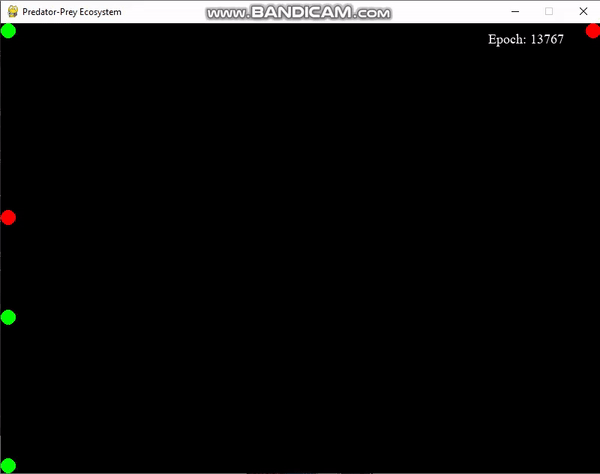

# Predator-Prey-Simulation
Python script I wrote to showcase reinforcement learning/Genetic algorithms.

The way version 8 works:
There are two predators (cat) and one prey (mouse).

They are initialized with 'brains' that are random values represented in a Numpy array. 

These values (weights) interact with the input values to the brains (their location on the screen, the location of the others, etc.)

The values (weights) of the brain are mutated under these conditions:

If either a cat or mouse is touching the edge of the screen, their brains mutate.
If a cat does not catch a mouse, its brain mutates.
If a mouse is caught by a cat, its brain mutates.

(3 mice, to cats in demo, wall mutation on)

